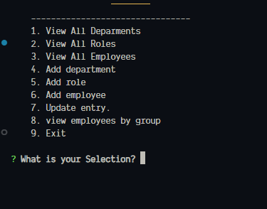

# Buisness organization tracker

## Description

Simple little node and mysql applet to keep track of buisness stuff. You can keep track of the departments, roles and employees of the buisness and the day to day that deals with them.

## Table Of Cotents

- [Description](#description)
- [Requirements](#requirments)
- [Installation](#installation)
- [Usage](#usage)
- [Deployed](#deployed)

## Requirments

To run this you need to hae npm installed and nodejs installed. You also are going to need to install mysql and mysql workbench.

## Installation
To get this up and runing simply download the repo. Extract and navigate your browser to the location of the index.js. Run `npm install` to get the required `npm modules`. Then you are going to want to open up mysql workbench and connect to a server. Create a db with the name `buisness` and then run all of the files in the sql folder. In order of buisnesss_department, buisnesss_role, buisnesss_employee then seed.

## Usage
Very simple to use first navigate to the folder where it was extracted to. Next run `node start`.

You can then navigate through the menus and select what you want.

Here is a video how to use it.

[Here](https://app.castify.com/view/b3c52a5c-66e5-4c39-b3af-a8ddb6fbda85)